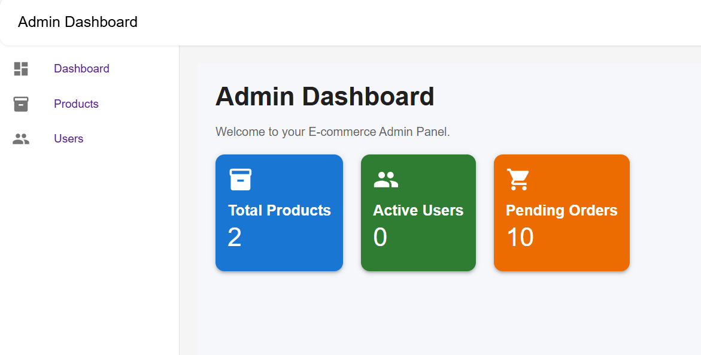
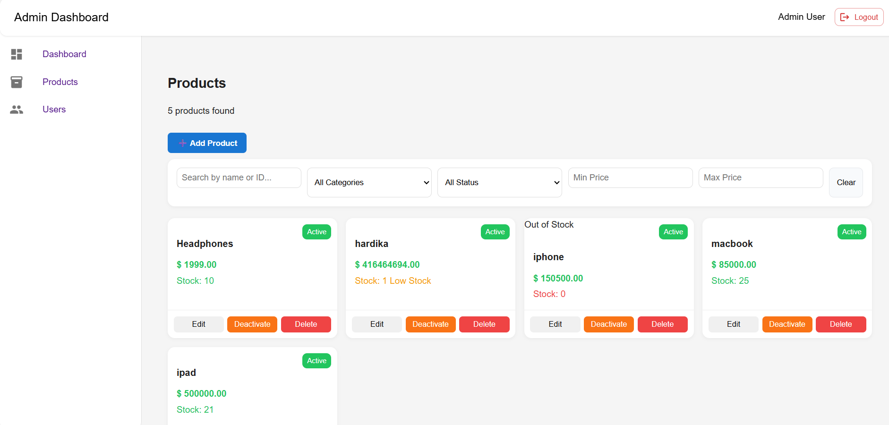
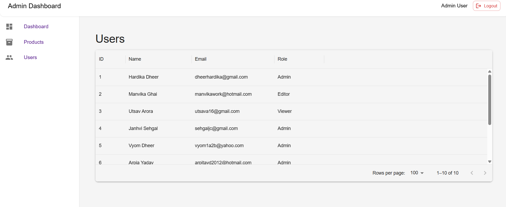

# Ecommerce Admin Portal

A modern and responsive Ecommerce Admin Dashboard built using **React.js**, **Node.js**, and **Express.js**.  
This project allows administrators to efficiently manage products, users, inventory, and dashboard operations through an interactive admin interface.

---

## Features

- Admin Authentication UI
- Interactive Dashboard
- Product Management System
- Add / Edit / Delete Products
- Product Search & Filtering
- Inventory & Stock Management
- User Management Table
- Responsive Sidebar Navigation
- Backend API Integration
- CRUD Operations
- Clean & Modern UI

---

## Tech Stack

### Frontend
- React.js
- JavaScript
- HTML5
- CSS3

### Backend
- Node.js
- Express.js

### Database
- MongoDB

### Tools & Libraries
- Axios
- Material UI
- React Router DOM

---

## Project Structure

```text
ecommerce-admin-portal/
│
├── public/
├── screenshots/
├── server/
│   ├── server.js
│   ├── package.json
│
├── src/
│   ├── assets/
│   ├── components/
│   ├── pages/
│   ├── styles/
│   ├── utils/
│
├── package.json
├── README.md
```

---

## Installation & Setup

### Clone Repository

```bash
git clone https://github.com/hardikadheer/ecommerce-admin-portal.git
```

---

## Frontend Setup

```bash
npm install
npm start
```

Frontend runs on:

```text
http://localhost:3000
```

---

## Backend Setup

```bash
cd server
npm install
node server.js
```

Backend runs on:

```text
http://localhost:5000
```

---

# Screenshots

## Login Page


---

## Dashboard


---

## Products Page


---

## Add Product Page


---

## Users Page


---

# Future Improvements

- JWT Authentication
- Role-Based Access Control
- Product Image Upload
- Revenue Analytics Dashboard
- Sales Charts & Graphs
- Order Management System
- Dark Mode
- Real-time Notifications
- Payment Gateway Integration
- Mobile Responsive Optimization

---

# Learning Outcomes

Through this project, I gained hands-on experience with:

- React Component Architecture
- Frontend & Backend Integration
- REST APIs
- CRUD Operations
- State Management
- Responsive UI Design
- Git & GitHub Workflow
- Full Stack Project Structure

---

# Author

## Hardika Dheer

B.Tech CSE (AI/ML) Student  
Frontend & Full Stack Development Enthusiast

GitHub: https://github.com/hardikadheer

---

# Repository Link

https://github.com/hardikadheer/ecommerce-admin-portal
